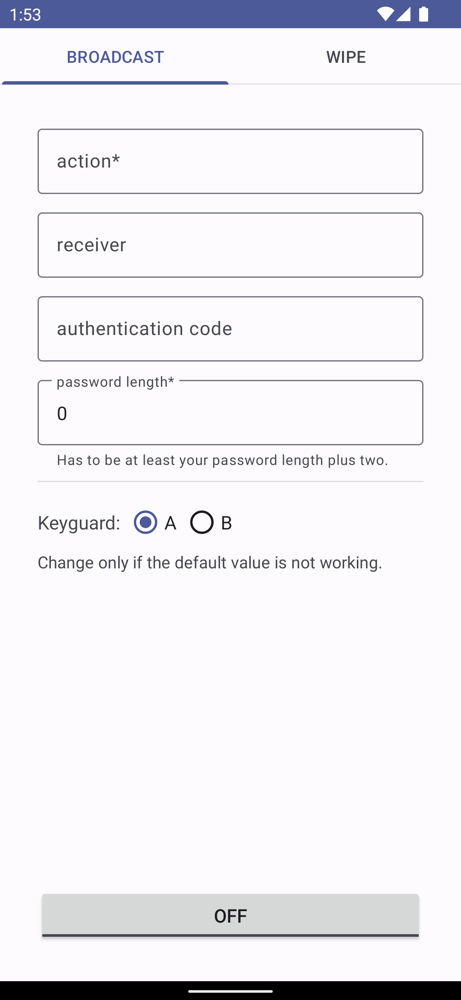

# Duress

Duress password trigger.

Tiny app to listen for a duress password on the lockscreen.  
When found, it can send a broadcast message or wipe the device.

Also take a look at:
* [Wasted](https://github.com/x13a/Wasted)
* [Sentry](https://github.com/x13a/Sentry)

## Tested

* Emulator, Android 12
* Google Pixel 4a/5a, Android 12
* Samsung Tab S8, Android 12

## Permissions

* ACCESSIBILITY - listen for a duress password on the lockscreen
* DEVICE_ADMIN - wipe the device (optional)

## Localization

## Related

* [pam_duress](https://github.com/rafket/pam_duress)
* [pam_panic](https://github.com/pampanic/pam_panic)
* [pam-party](https://github.com/x13a/pam-party)
* [lockup](https://github.com/nekohasekai/lockup)
* [pam-duress](https://github.com/nuvious/pam-duress)

## License

